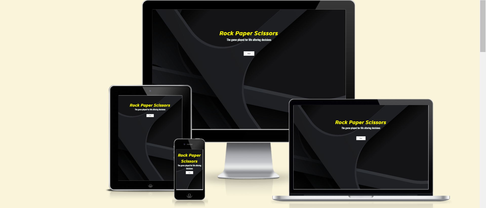
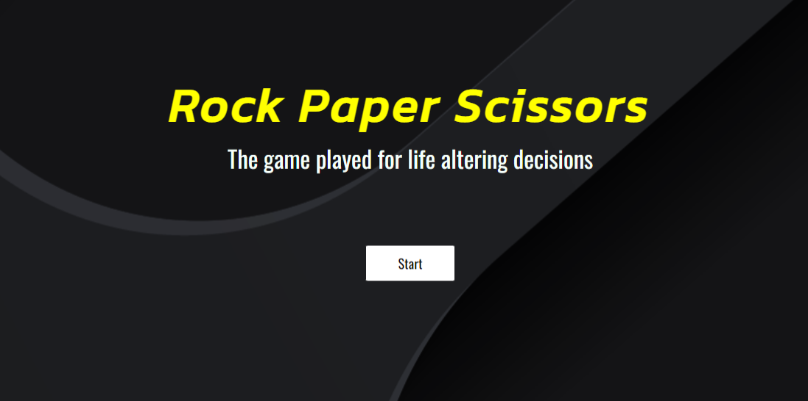

# Rock Paper Scissors
The <a href="">Rock Paper Scissors</a> website is designed for a user to play against the computer in a game of rock paper scissors. The computer generates random choices and the game reveals who the winner is. There is also a scoreboard to reveal who is in the lead. This game was made to display pure Javascript concepts.

## Features

### Landing Page

This page introduces the user to the page. The start button will lead the user to the main game page.

### Title and Username Input

This part of the main game page features a header with the name of the game, the classic saying while playing a game of rock paper scissors and also an option for the user to enter a username which would then be featured on the scoreboard.

### Buttons and Result 

This part of the page features buttons, offering the user the three options in a game of rock paper scissors and then the computer generates a random choice for itself. Then, the results is revealed with the a sentence under the buttons.

### Scoreboard

 The scoreboard updates as the game is played. Also, the user can use the input feature at the top of the page to enter his own username which would replace the userscore name.

## Accessibility
I've been careful to try to make this website ass accessible as possible. I've done this by:
<li>Ensuring that I use the correct semantic HTML,</li>
<li>Using alt attributes on images that are descriptive,</li>
<li>Using the aria-label attribute when using icons,</li>
<li>By using colors that have strong contrast.</li>

## Technologies Used

I used HTML, CSS and Javascript to create this website.

The programs I used include:
<li>GitHub - To store files for the website,</li>
<li>Git - for version control,</li>
<li>Google fonts - To import the font I use on the website,</li>
<li>Font Awesome - for the icons used on this website,</li>
<li>Google Dev tools - To find and resolve issues with styling. Also to used the Lighthouse feature,</li>
<li>Am I Responsive - To show the website images on different sized devices.</li>

## Deployment & Local Deployment

### Deploymment
I used GitHub Pages to deploy the website. This is how I did it:
<ol>
<li>I logged in to GitHub.</li>
<li>I went to the repository for this project, Golden Age Page.</li>
<li>I went to the settings menu.</li>
<li>I clicked on the Pages tab on the navigation bar.</li>
<li>I found the Source section, then choose main from the drop down select branch menu. I then selected the Root from the drop down select folder menu.
</li>
<li>I then saved it and revieved a URL with the site deployed.</li>
 </ol><a href=>Rock Paper Scissors</a>

 ### Local Deployment
Inorder to Fork the Rock Paper Scissors repository I logged into GitHub, then found the Rock Paper Scissors repository and then clicked on the Fork button.
 For me to Clone the Golden Age page I logged in to GitHub, went to the repository for this project.
I then clicked on the code button, selected whether I would like to clone with HTTPS, SSH or GitHub CLI and copied the link shown.
I opened the terminal in my code editor and changed the current working directory to the location I wanted to use for the cloned directory. I then typed git clone into the terminal and then pasted the link I copied earlier. You need a http server installed.

## Testing
I tested the page using different browsers including: Google Chrome, Firefox and Safari.
I loaded the page on different screen sizes to make sure it is responsive, aesthetically please and functioning.
I also made sure that font-sizes and colors are readable.
I did some trial runs to make sure the form is functioning in the way it is expected in standard practice.
I played the game multiple times. Played the game in a slow manner and also played the game very fast. I found different result in these cases.
The start button on the start page works cleanly.

## Bugs
I found that when playing the game a little fast there's no response from the game. I personally didn't see the issue with it as for me it kills the suspense of winning or losing when constantly clicking on the buttons.

## Validator Testing
<li>HTML - I put the website through the <a href="https://validator.w3.org/nu/?doc=https%3A%2F%2Fjibab96.github.io%2FRock-Paper-Scissors-PP2%2Fgame.html">W3C Vaidator</a>. No errors were found.</li>
<li>CSS - I put the website through the <a href="https://jigsaw.w3.org/css-validator/validator?uri=https%3A%2F%2Fjibab96.github.io%2FRock-Paper-Scissors-PP2%2F&profile=css3svg&usermedium=all&warning=1&vextwarning=&lang=en">Jigsaw</a> Validator. No errors were found.</li>
<li>Javascript - I put the javascript code through the <a href="https://jshint.com/">JShint</a> validator. I found errors pertaining to features only being available in ES6. Ouside of that no errors were found. The metrics were as follows: <ul>
<li>There are 13 functions in this file.</li>
<li>Function with the largest signature take 2 arguments, while the median is 0.</li>
<li>Largest function has 6 statements in it, while the median is 1.</li>
<li>The most complex function has a cyclomatic complexity value of 10 while the median is 1.</li>
</ul></li>
<li>I ran the project through the lighthouse in devtools and found that my accessibilty rating was 100.</li>
 
 ## Unfixed Bugs
No unfixed bugs were found.

## Credits

#### Media
<li>I downloaded the background image from <a href="https://4kwallpapers.com/abstract/dark-background-abstract-background-network-3d-background-8324.html">4Kwallpapers</a>.</li>
<li>I downloaded the hand sign images from the <a href="https://www.flaticon.com/search?word=rock">flaticon</a> website.</li>

### Content
<li>I first found the switch statements in order to determine a winner from <a href="https://betterprogramming.pub/7-ways-to-code-rock-paper-scissors-in-javascript-4189a5e7e535">betterprogramming</a>.</li>

<li> I ran into problems on what functions I needed so I learnt a lot from <a href="https://www.youtube.com/watch?v=jaVNP3nIAv0&ab_channel=freeCodeCamp.org">freecodecamp</a> youtube walkthrough on how to structure and what functions I needed for the game. </li>

